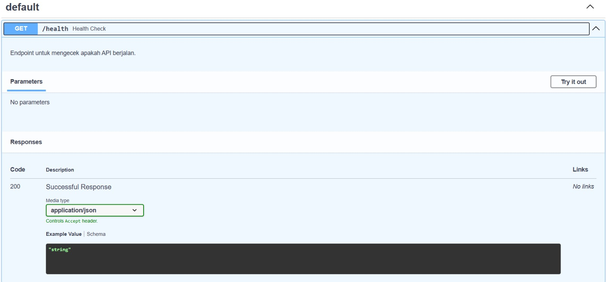
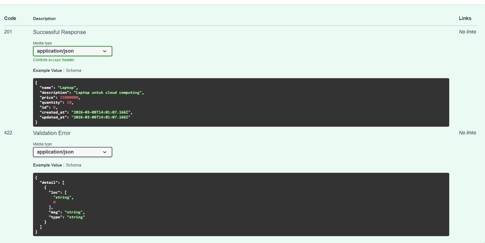
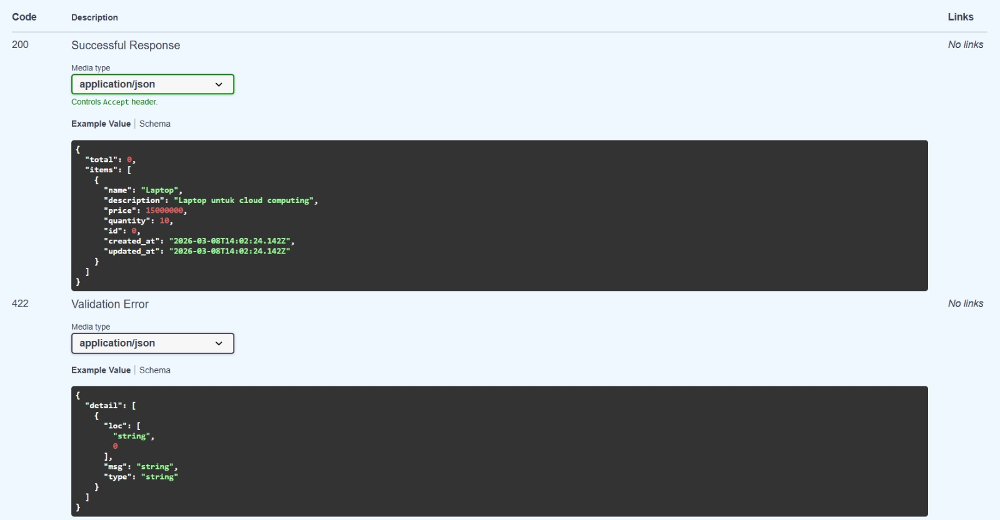
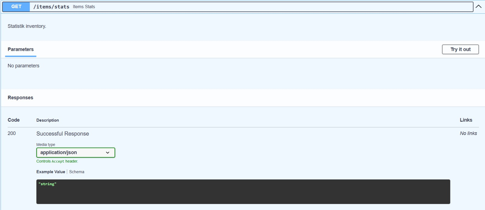
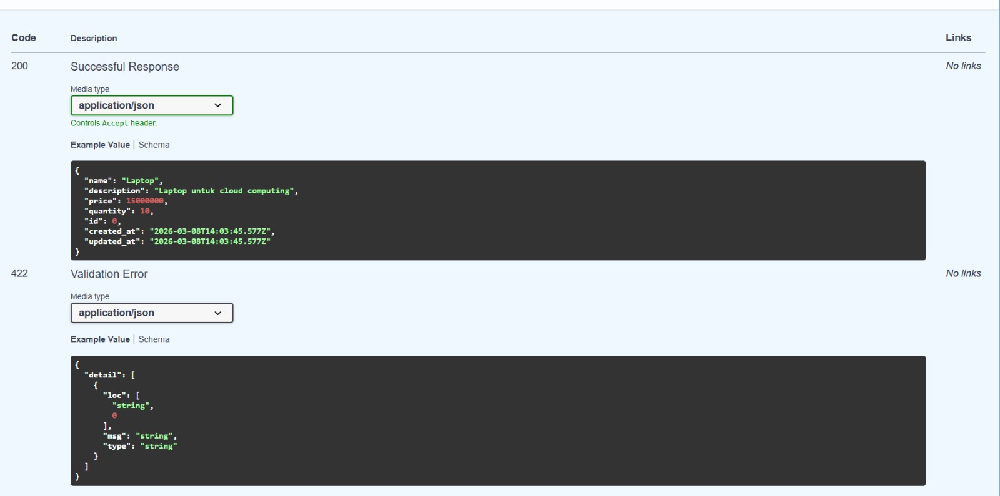
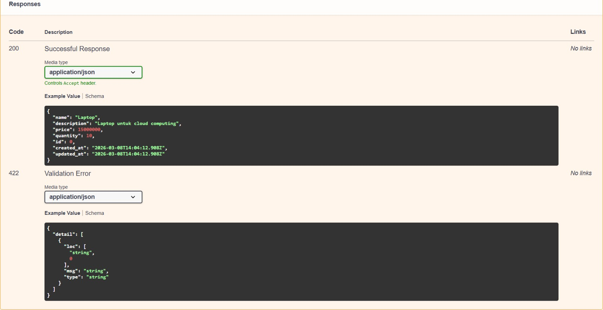
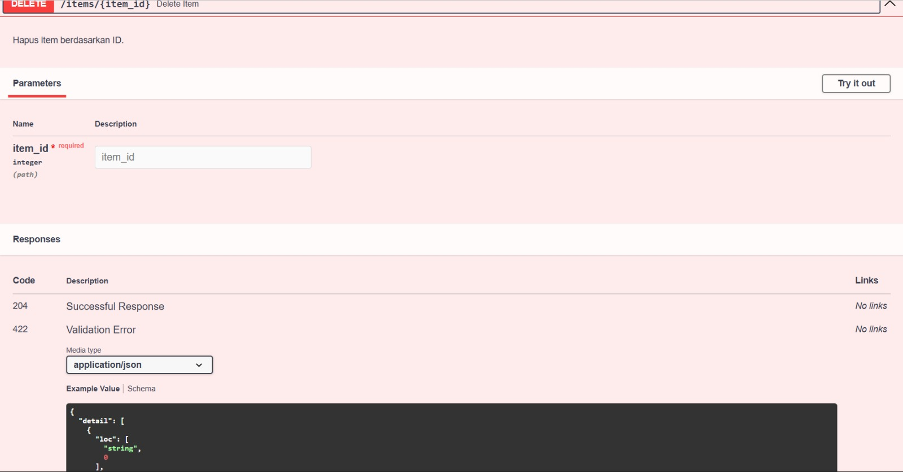
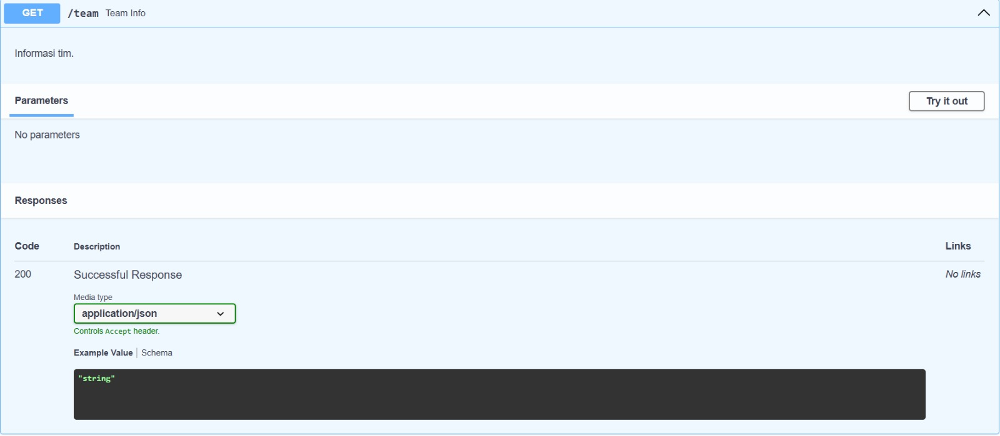

# API Test Results

Testing dilakukan menggunakan **Swagger UI**
URL: http://localhost:8000/docs

---

## 1. GET /health

Endpoint untuk mengecek apakah API berjalan.

Screenshot hasil testing:

---

## 2. POST /items

Endpoint untuk membuat item baru di database.

Screenshot hasil testing:

---

## 3. GET /items

Endpoint untuk mengambil semua data item.

Screenshot hasil testing:

---

## 4. GET /items/stats

Endpoint untuk menampilkan statistik inventory.

Screenshot hasil testing:

---

## 5. GET /items/{item_id}

Endpoint untuk mengambil item berdasarkan ID.

Screenshot hasil testing:

---

## 6. PUT /items/{item_id}

Endpoint untuk memperbarui data item.

Screenshot hasil testing:

---

## 7. DELETE /items/{item_id}

Endpoint untuk menghapus item.

Screenshot hasil testing:

---

## 8. GET /team

Endpoint untuk menampilkan informasi tim.

Screenshot hasil testing:

