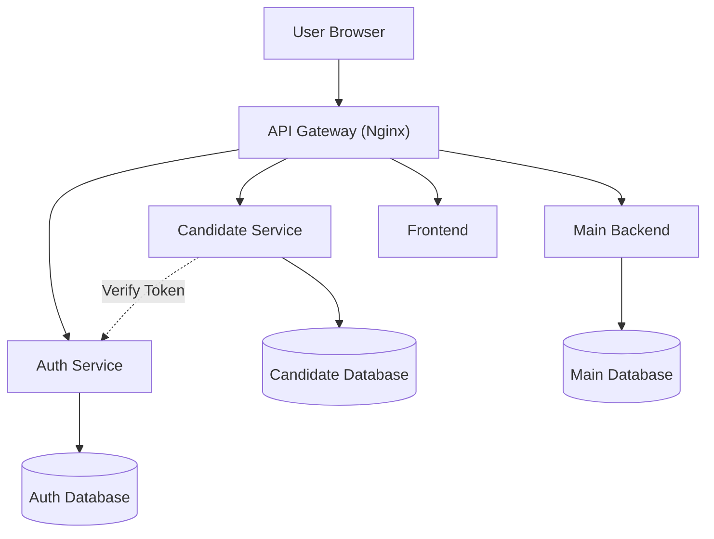

# Hybrid Architecture

## Overview

Pada Milestone 3, aplikasi SIPILIH mulai mengadopsi pendekatan service decomposition sebagai langkah menuju arsitektur microservices. Beberapa komponen utama telah dipisahkan menjadi service tersendiri, seperti Auth Service dan Candidate Service, sementara backend utama (monolith) masih digunakan untuk beberapa fitur yang belum sepenuhnya dipisahkan.

Pendekatan hybrid ini memungkinkan pengembangan dilakukan secara bertahap tanpa mengganggu fitur yang telah berjalan sebelumnya.

---

## Architecture Diagram



---

## Services

| Service            | Port | Responsibility             |
| ------------------ | ---- | -------------------------- |
| Frontend           | 3000 | User Interface             |
| API Gateway        | 80   | Request Routing            |
| Main Backend       | 8000 | Legacy Features & Core API |
| Auth Service       | 8001 | Authentication & JWT       |
| Candidate Service  | 8002 | Candidate Management       |
| Main Database      | 5433 | Core Application Data      |
| Auth Database      | 5434 | Authentication Data        |
| Candidate Database | 5435 | Candidate Data             |

---

## Service Responsibilities

### Main Backend

Backend utama yang masih menangani beberapa fitur inti aplikasi dan fungsi yang belum dipisahkan ke service tersendiri.

### Auth Service

Bertanggung jawab terhadap:

* User Registration
* Login
* JWT Generation
* Token Verification
* User Authentication

### Candidate Service

Bertanggung jawab terhadap:

* Candidate Management
* Candidate Statistics
* Candidate Information
* Admin Candidate Operations

### API Gateway

Bertindak sebagai entry point untuk seluruh request yang masuk ke sistem serta melakukan routing ke service yang sesuai.

---

## Inter-Service Communication

Candidate Service tidak melakukan autentikasi secara mandiri.

Untuk memverifikasi pengguna, Candidate Service mengirim request ke Auth Service melalui endpoint verifikasi token.

Contoh alur komunikasi:

```text
Candidate Service
        ↓
GET /verify
        ↓
Auth Service
        ↓
User Information Returned
```

---

## Running Locally

Menjalankan seluruh container:

```bash
docker compose up --build
```

Melihat status container:

```bash
docker compose ps
```

Melihat seluruh log:

```bash
docker compose logs -f
```

---

## Debugging

### Main Backend

```bash
docker compose logs backend
```

### Auth Service

```bash
docker compose logs auth-service
```

### Candidate Service

```bash
docker compose logs candidate-service
```

### Gateway

```bash
docker compose logs gateway
```

### Databases

```bash
docker compose logs db
docker compose logs auth-db
docker compose logs candidate-db
```

---

## Reliability Features

### Retry Mechanism

Candidate Service menggunakan retry mechanism ketika melakukan komunikasi dengan Auth Service. Jika terjadi gangguan sementara, request akan dicoba kembali secara otomatis menggunakan exponential backoff.

### Circuit Breaker

Circuit breaker digunakan untuk mencegah cascading failure ketika Auth Service tidak tersedia. Setelah batas kegagalan tertentu tercapai, service akan memasuki state OPEN dan menghentikan request sementara hingga cooldown selesai.

### Logging & Monitoring

Setiap service dilengkapi middleware logging untuk membantu proses debugging, observability, dan monitoring.

Komponen logging:

* logging_config.py
* logging_middleware.py

### Metrics Collection

Masing-masing service menyediakan endpoint metrics untuk membantu monitoring performa aplikasi.

### Recovery Process

Ketika service yang mengalami gangguan kembali aktif, circuit breaker akan melakukan recovery secara otomatis sehingga sistem dapat kembali beroperasi tanpa perlu melakukan restart seluruh aplikasi.
