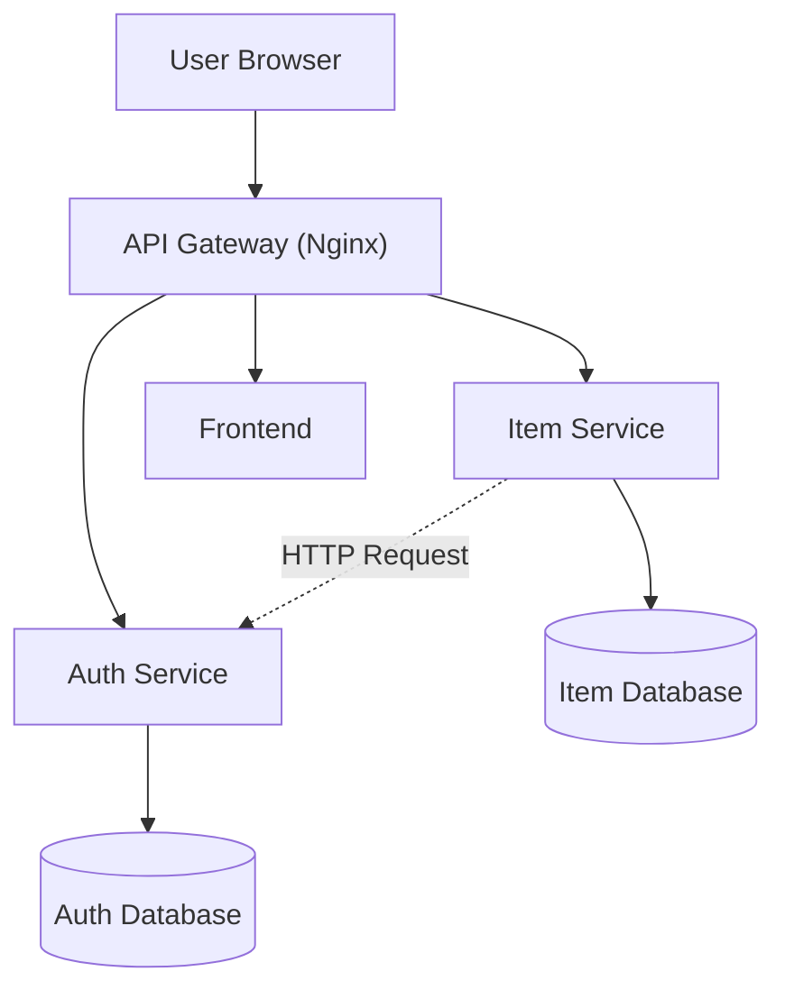

# Microservices Architecture

## Overview

Pada Milestone 3, aplikasi SIPILIH mengalami transformasi dari arsitektur monolith menjadi arsitektur microservices. Setiap layanan memiliki tanggung jawab yang spesifik, database terpisah, dan dapat dijalankan secara independen.

---

## Architecture Diagram



---

## Services

| Service       | Port | Responsibility       |
| ------------- | ---- | -------------------- |
| Frontend      | 3000 | User Interface       |
| API Gateway   | 80   | Request Routing      |
| Auth Service  | 8001 | Authentication & JWT |
| Item Service  | 8002 | CRUD Item Management |
| Auth Database | 5432 | User Data            |
| Item Database | 5432 | Item Data            |

---

## Database Per Service

### Auth Service Database

Menyimpan data pengguna seperti email, nama, dan password yang telah di-hash.

### Item Service Database

Menyimpan data item, harga, jumlah stok, dan owner item.

Setiap service hanya dapat mengakses databasenya sendiri untuk menjaga independensi dan loose coupling.

---

## API Contract

### Auth Service

#### Register User

```http
POST /register
```

Request:

```json
{
  "email": "user@example.com",
  "password": "password123",
  "name": "User"
}
```

Response:

```json
{
  "id": 1,
  "email": "user@example.com",
  "name": "User"
}
```

---

#### Login User

```http
POST /login
```

Response:

```json
{
  "access_token": "jwt-token",
  "token_type": "bearer"
}
```

---

#### Verify Token

```http
GET /verify
```

Header:

```http
Authorization: Bearer <token>
```

Response:

```json
{
  "user_id": 1,
  "email": "user@example.com",
  "name": "User"
}
```

---

### Item Service

#### Create Item

```http
POST /items
```

#### Get Items

```http
GET /items
```

#### Get Item By ID

```http
GET /items/{id}
```

#### Update Item

```http
PUT /items/{id}
```

#### Delete Item

```http
DELETE /items/{id}
```

---

## Inter-Service Communication

Item Service tidak mengakses database Auth Service secara langsung. Verifikasi token dilakukan dengan melakukan HTTP Request ke endpoint `/verify` pada Auth Service.

Contoh:

```text
Item Service
      ↓
GET /verify
      ↓
Auth Service
      ↓
User Data Returned
```

---

## Running Locally

Menjalankan seluruh service:

```bash
docker compose up --build
```

Melihat status container:

```bash
docker compose ps
```

Melihat seluruh log:

```bash
docker compose logs -f
```

---

## Debugging

### Auth Service

```bash
docker compose logs auth-service
```

### Item Service

```bash
docker compose logs item-service
```

### Gateway

```bash
docker compose logs gateway
```

### Database

```bash
docker compose logs auth-db
docker compose logs item-db
```

---

## Benefits of Microservices

* Service dapat dideploy secara independen.
* Database terpisah untuk setiap service.
* Memudahkan scaling sesuai kebutuhan.
* Mengurangi dampak kegagalan pada seluruh sistem.
* Mendukung pengembangan oleh banyak tim secara paralel.

## Reliability Features

### Retry Mechanism

Candidate Service dan Vote Service menggunakan auth client untuk melakukan komunikasi dengan Auth Service. Ketika terjadi gangguan jaringan atau service tidak dapat diakses, sistem melakukan retry secara otomatis menggunakan exponential backoff.

### Circuit Breaker

Circuit breaker digunakan untuk mencegah cascading failure ketika dependency tidak tersedia. Setelah batas kegagalan tertentu tercapai, service akan menghentikan request sementara dan memasuki state OPEN hingga cooldown selesai.

### Logging & Monitoring

Setiap service dilengkapi dengan logging middleware dan konfigurasi logging terpusat untuk membantu proses debugging serta observability.

Komponen logging:

* logging_config.py
* logging_middleware.py

### Metrics Collection

Sistem menyediakan metrik operasional melalui modul metrics.py untuk membantu monitoring performa service.

### Recovery Process

Ketika service kembali aktif, circuit breaker akan melakukan proses recovery dan mengembalikan sistem ke kondisi normal tanpa perlu restart seluruh aplikasi.
