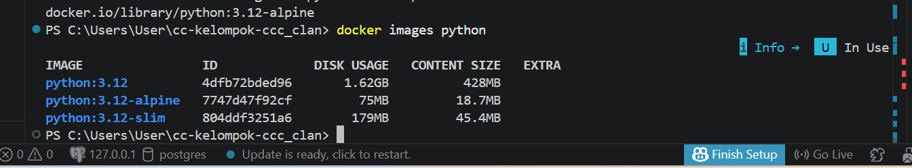

# Image Size Comparison

## Results

Berikut hasil perbandingan ukuran image Python berdasarkan output dari terminal:

## Analysis

Berdasarkan hasil perbandingan ukuran image:

- **python:3.12** memiliki ukuran paling besar karena menggunakan base image standar berbasis Debian (sistem operasi berbasis linux yang bersifat bebas dan open source) yang lengkap. Image ini sudah membawa banyak library dan tools bawaan (seperti build tools, system utilities, dan dependency umum) yang membuatnya siap digunakan untuk berbagai kebutuhan, tetapi berdampak pada ukuran yang sangat besar.

- **python:3.12-slim** merupakan versi yang lebih ringan dari image standar. Image ini masih berbasis Debian, tetapi banyak komponen yang tidak terlalu diperlukan (seperti dokumentasi, package tambahan, dan beberapa tools sistem) sudah dihapus. Hasilnya, ukuran image menjadi jauh lebih kecil, namun tetap kompatibel untuk sebagian besar aplikasi Python.

- **python:3.12-alpine** adalah image dengan ukuran paling kecil karena menggunakan Alpine Linux sebagai base image, yang memang dirancang sangat minimal. Alpine hanya menyediakan komponen inti sistem sehingga ukurannya sangat kecil. Namun, karena menggunakan library yang berbeda (musl libc, bukan glibc seperti Debian), terkadang dapat menimbulkan masalah kompatibilitas dengan beberapa package Python tertentu.

## Conclusion

Image **python:3.12-slim** dipilih karena memberikan keseimbangan antara ukuran yang lebih ringan dan kesesuaian yang lebih baik dibandingkan alpine.