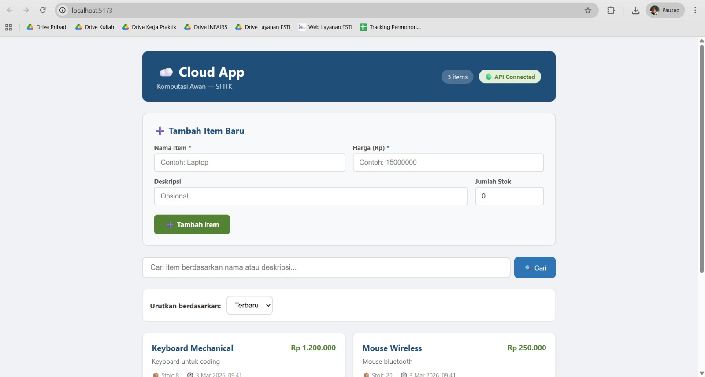
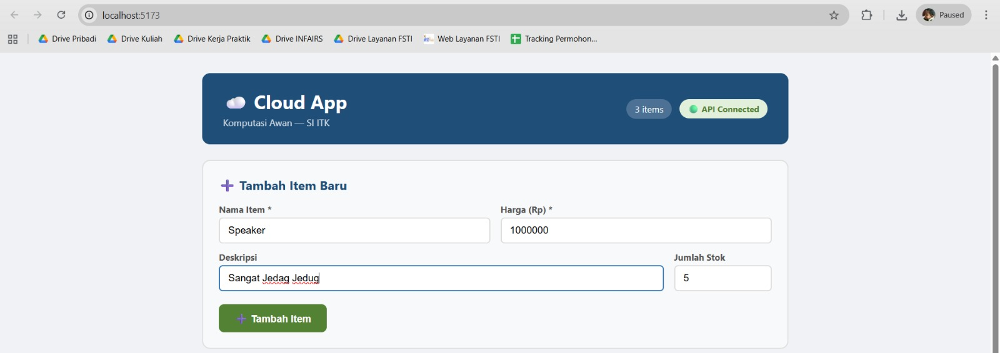
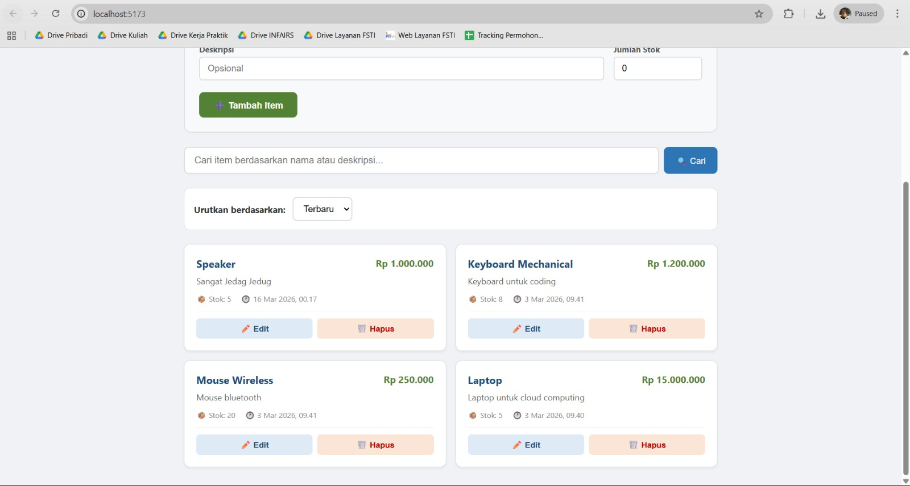
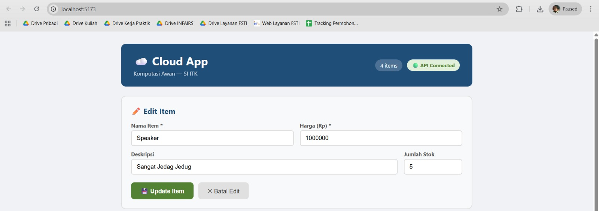
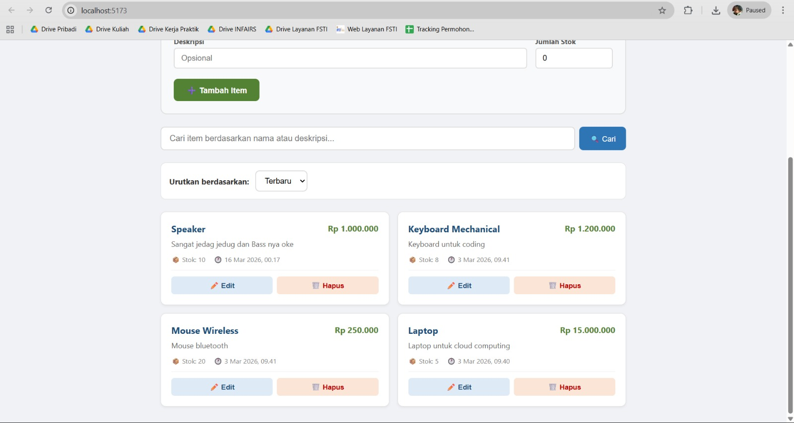
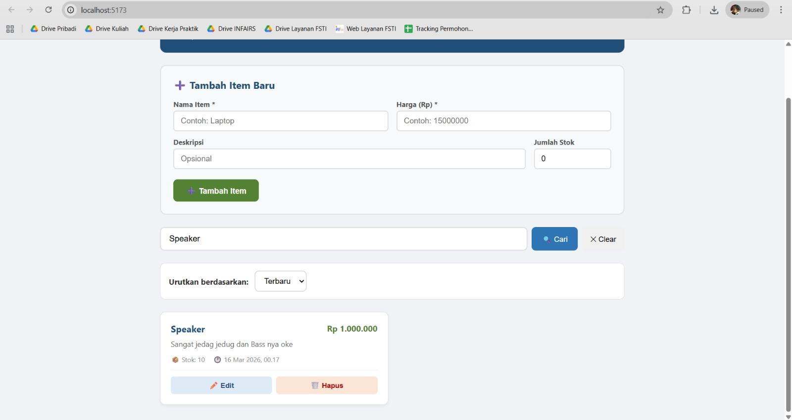
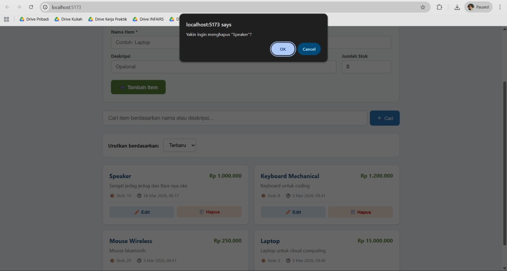
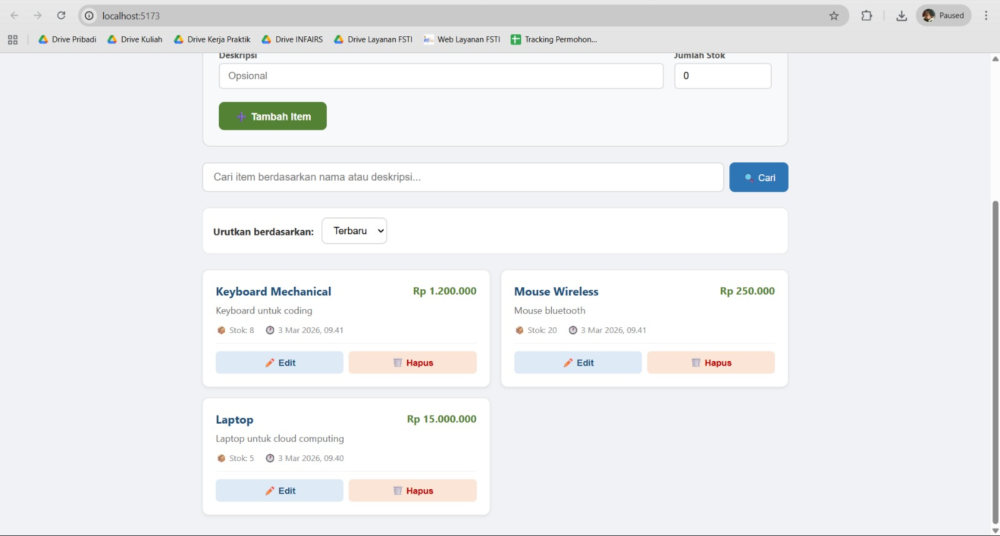
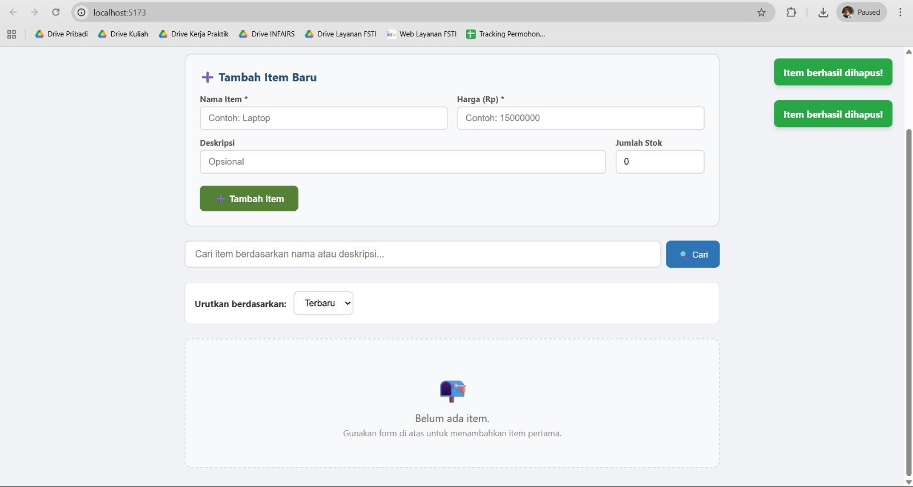

# UI Testing Results

## Test Case 1 – API Connection
- Status: Berhasil
- Penjelasan: Pengujian ini dilakukan untuk memastikan frontend berhasil terhubung dengan backend API saat aplikasi pertama kali dibuka. Dimana hasil yang diharapkan dan yang ditampilkan adalah halaman utama yang menampilkan tulisan Cloud App, badge hijau API Connected, serta jumlah item yang tersedia. Ini menunjukkan koneksi antara frontend dan backend berjalan dengan baik.
- Screenshot:

---

## Test Case 2 – Items Loaded
- Status: Berhasil
- Penjelasan: Pengujian ini dilakukan untuk memastikan data item dari database berhasil ditampilkan di antarmuka aplikasi. Hasil yang diharapkan dan ditampilkan yaitu daftar item muncul di halaman dengan informasi seperti nama item, harga, deskripsi, dan stok. Minimal terdapat beberapa item yang berhasil dimuat dari database.
- Screenshot:

---

## Test Case 3 – Fill Create Form
- Status: Berhasil
- Penjelasan: Pengujian ini dilakukan untuk memastikan form input item dapat menerima data yang dimasukkan oleh pengguna sebelum proses penyimpanan dilakukan. Hasil yang diharapkan dan dihasilkan yaitu field nama, harga, stok, dan deskripsi berhasil diisi pada form dan siap untuk dikirim ke server ketika tombol tambah ditekan.
- Screenshot:

---

## Test Case 4 – Item Created
- Status: Berhasil
- Penjelasan: Pengujian ini dilakukan untuk memastikan fitur Create (POST API) bekerja dengan baik untuk menambahkan item baru ke database. Hasil yang diharapkan dan ditampilkan yaitu setelah tombol Tambah Item ditekan, item baru langsung muncul pada daftar item, menandakan data berhasil disimpan di database.
- Screenshot:

---

## Test Case 5 – Edit Mode
- Status: Berhasil
- Penjelasan: Pengujian ini dilakukan untuk memastikan fitur Edit dapat mengambil data item yang dipilih dan menampilkannya kembali pada form untuk diubah. Hasil yang diharapkan dan dihasilkan yaitu ketika tombol Edit diklik, form otomatis terisi dengan data item yang dipilih sehingga pengguna dapat melakukan perubahan.
- Screenshot:

---

## Test Case 6 – Item Updated
- Status: Berhasil
- Penjelasan: Pengujian ini dilakukan untuk memastikan fitur Update (PUT API) dapat memperbarui data item yang sudah ada di database. Hasil yang diharapkan dan dihasilkan yaitu setelah perubahan dilakukan (misalnya deskripsi diubah) dan tombol Update Item ditekan, maka data item pada daftar berhasil diperbarui.
- Screenshot:

---

## Test Case 7 – Search Item
- Status: Berhasil
- Penjelasan: Pengujian ini dilakukan untuk memastikan fitur Pencarian dapat memfilter item berdasarkan kata kunci yang dimasukkan pengguna. Hasil yang diharapkan dan dihasilkan yaitu setelah kata kunci dimasukkan pada kolom pencarian, daftar item otomatis menampilkan item yang sesuai dengan kata kunci tersebut.
- Screenshot:

---

## Test Case 8 – Delete Confirm
- Status: Berhasil
- Penjelasan: Pengujian ini dilakukan untuk memastikan sistem menampilkan konfirmasi penghapusan sebelum item benar-benar dihapus. Hasil yang diharapkan dan dihasilkan yaitu ketika tombol Hapus diklik, muncul popup konfirmasi untuk memastikan apakah pengguna benar-benar ingin menghapus item tersebut.
- Screenshot:

---

## Test Case 9 – Item Deleted
- Status: Berhasil
- Penjelasan: Pengujian ini dilakukan untuk memastikan fitur Delete (DELETE API) dapat menghapus item dari database. Hasil yang diharapkan dan dihasilkan yaitu setelah konfirmasi penghapusan dilakukan, item tersebut hilang dari daftar item yang ditampilkan.
- Screenshot:

---

## Test Case 10 – Empty State
- Status: Berhasil
- Penjelasan: Pengujian ini dilakukan untuk memastikan aplikasi dapat menampilkan kondisi ketika tidak ada data item yang tersedia. Hasil yang diharapkan dan dihasilkan yaitu jika semua item dihapus, aplikasi menampilkan pesan belum ada item, yang menunjukkan daftar item dalam keadaan kosong.
- Screenshot:
